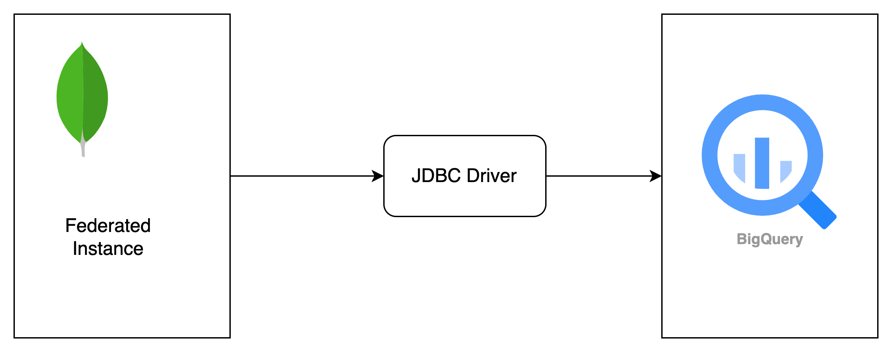

# Atlas SQL + BigQuery

MongoDb Atlas SQL provides with SQL Interface that you can leverage existing SQL knowledge and familiar tools to query and analyze Atlas data live.

BigQuery is a Column oriented enterprise data warehouse well suited for running analytical queries. Bigquery does not support concurrent execution of queries for real time analytics.

MongoDB Atlas and Bigquery complement each other, with Mongodb handling real time operational data and Bigquery managing the curated subset of data replicated from Mongodb for complex analytics and enhance the data and user experience with it.

Accessing MongoDB data requires knowledge of MQL and formatting the JSON data. To simplify the user who has expertise in SQL development MongoDB Atlas SQL comes to rescue. Atlas SQL helps to run SQL query on MongoDB database.




### Build the package
```
mvn clean compile
```

### Run the package
```
mvn exec:java -Dexec:mainClass=org.example.Utils -Dexec.args="<bq_dataset> <bq_table> <mdb_user> <mdb_pass> <Atlas_datalake_name> <collection_name> <deapth>" -X
```
